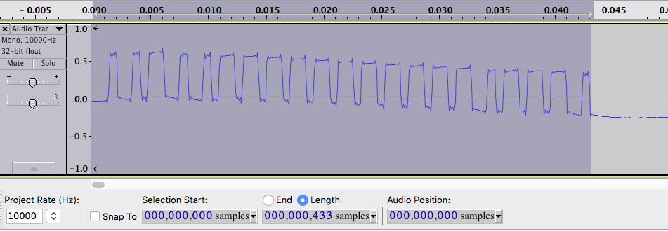
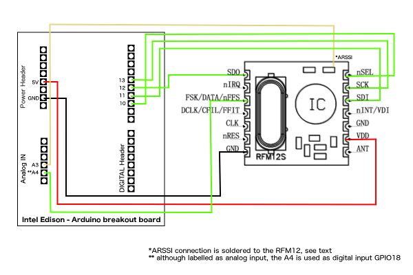


Receiving a 433 MHz OOK Signal Using RFM12 and Intel Edison
=========================================================
The 433MHz **ISM** band is home of the communication channel for a lot of IoT devices. Temperature sensors use it to broadcast their readings. Power outlets use it to receive switch commands.  Garage doors listen to it for a magic “Open Sesame!” sequence...
To monitor what’s going on in my neighbourhood on this band, I have created a radio interface, that extracts RF signals and makes them visible through a command-line interface. 

During a transmission, information can be modulated onto the radiowave in different ways. Most consumer RF devices use a simple On-Off-Keying (OOK), where the signal is just switched on and off, thus creating pulses of variable length. A slightly modified OOK would be the so-called ASK (amplitude shift keying), where the height of the amplitude corresponds to a logic value. 

The **RFM12** is a popular transceiver module, that is also available for the 433 band. Although slightly outdated, it is perfectly suitable for the task and not expensive at all. All parameters, like frequency, filter and modes, are set up through a SPI compatible interface. 
Additional functionality is available on a few extra pins. Also, the module can be modified in a way that makes it possible to get an analog value of the signal strength - this is known as analog received signal strength indicator (ARSSI). To tap this particular signal, I soldered a wire to the module. It did provide an easy way to capture raw demodulated signals, but it turned out not to be necessary to decode incoming signals.



To control the RFM12, I decided to go with an Intel Edison with the Arduino Breakout Board - it has integrated WiFi (so I didn’t need a USB WiFi adapter) and runs on a linux kernel. There are a lot of packages available that enhance its functionality. Because the Edison is targeted to the IoT world, it’s fairly easy to add communication protocols like **MQTT** to applications or to connect it to cloud services. For now, a running console that connects via **ssh** to the Edison is sufficient to demonstrate the reception of OOK signals.



I wanted to control the RFM12 using the SPI functionality of the Edison that is supposed to be available on the pins 10-13 on the Arduino header - but that didn’t work. To be exact: the SPI SELECT (GPIO 10) and the CLOCK (13) did work, but I couldn’t get the MOSI pin (11) to pulse in the rhythm of the data. So I made my own SPI routine - which was fairly simple, because this protocol is not very complex.

I can access the RF module by sending 16bit commands in hexadecimal coding. Since each bit that gets **into** a SPI device also clocks **out** a bit, every command yields a response. The command-line interface returns that response as a hex number - that way it’s possible to read the status or the receiver fifo from the RFM12:

		$ rfm_cmd 0x0
		0x0142

It is important to notice one thing though: Because the mentioned Arduino breakout board handles all voltage level shifting and setting of the GPIOs output/input direction - there is a significant time needed to perform a simple OUTPUT write to a GPIO. To decrease the time needed to output data, I enabled memory mapped access provided by the MRAA library, that I use for low-level access of the devices GPIOs.

To programm the RFM12 to act as an OOK receiver, I initialized the module with a sequence of commands to enable OOK.

```
rfm_cmd(0x8017); // 433 Mhz;disable tx register; disable RX fifo buffer; xtal cap 12pf
rfm_cmd(0x82c0); // enable receiver ; enable basebandblock        = 430.2400 - 439.7575
rfm_cmd(0xa680); // default freq offset 1.16 MHz (results in f=434.16)
rfm_cmd(0xc691); // datarate 2395 kbps 0xc647 = 4.8kbps
rfm_cmd(0xC220); // datafiltercommand ; ** not documented command **
rfm_cmd(0xCA00); // FiFo and resetmode command ; FIFO fill disabeld
rfm_cmd(0xC473); // AFC run only once ; enable AFC ;enable frequency offset register ; +3 -4
rfm_cmd(0xCC67); // pll settings command
rfm_cmd(0xB800); // TX register write command NOT USED
rfm_cmd(0xC800); // low dutycycle disabeld
rfm_cmd(0xC040); // 1.66MHz,2.2V NOT USED see 82c0
rfm_cmd(0x948C); // VDI; FAST;200khz;GAIN -6db ;DRSSI 79dbm
```
Now the receiver monitors the DATA pin, which is wired to pin 18. The receiver waits until the signal on DATA is high. Now it starts to print out an ‘X’ for every tick interval DATA is held high and a ‘.’ when DATA is low. If the number of low ticks exceeds a threshold, the receiver considers the RF signal as ended.  

To get a sense of the radio signal's properties, like length, complexity, data rate etc., I have created a - I must admit: funny looking - text bar output.

	$ rfm_rx_ook data repeat
	XX.......XX....XXXXX.......XXX.......XX....XXXXX....XXXXX....XXXXXX....XXXXX...XXXXXX....XXXXX....XXXXXX...XXXXXX.......XX.......XX....XXXXXX...XXXXXX....XXXXX....XXXXX.......XXX......XXX..................................................
	XX.......XX....XXXXXX.......XX.......XX....XXXXX....XXXXXX...XXXXXX....XXXXX...XXXXXX....XXXXX....XXXXXX....XXXXX.......XX........X.....XXXXX....XXXXX....XXXXXX...XXXXXX.......XX.......XX..................................................
	XX.......XX.....XXXXX.......XX.......XX....XXXXXX....XXXXX....XXXXX....XXXXX.....XXXXX....XXXXX....XXXXX....XXXXX..................X....XXXXX.....XXXXX...XXXXXX...XXXXXX........X........X..................................................

I made the sources available in a [github repository](https://github.com/cayeric/edison/). Feel free to use it on your own receiver Project and let me know how it worked out for you!

References
----------
* [RFM12 datasheet](http://www.hoperf.com/upload/rf/RFM12.pdf)
* ARSSI RFM12 modification: [Receiving OOK/ASK with a modified RFM12B.](http://jeelabs.net/projects/cafe/wiki/) 
* improved jeelab ARSSI library: [Improved RFM12B with accurate RSSI reading Library](https://hallard.me/rfm12b_arssi-library/)
* jeelab forum: [RFM12/RFM12B as OOK/ASK receiver: it works!](http://talk.jeelabs.net/topic/66)
* mraa api for low level access of Edison features: [http://iotdk.intel.com/docs/master/mraa/index.html](http://iotdk.intel.com/docs/master/mraa/index.html)
* finding the right pin for specific functions on your Edison Arduino breakout board: [Intel® Edison GPIO Pin Multiplexing Guide](http://www.emutexlabs.com/project/215-intel-edison-gpio-pin-multiplexing-guide)
* RFM12 OOK config: [RFM12B OOK](http://openenergymonitor.org/emon/node/3369)
* experimenting with RFM12: [RFM12 programming](https://gobotronics.wordpress.com/tag/rfm12/)
* general RFM12 information: [tutorials](http://blog.strobotics.com.au/tutorials/rfm12-stuff/) 
* RFM12 library including ASK: [das-labor.org/wiki/RFM12_library](http://www.das-labor.org/wiki/RFM12_library)
* a supposedly working spi connection on port 10-13: [github: edison_capture](https://github.com/groupgets/LeptonModule/tree/master/software/edison_capture)

---
* Receiving signal from weather station sensor module: [RFM12 als Empfänger für TFA THX301 Funk Wetter Sensor](http://www.mikrocontroller.net/topic/161885) (german)
* RFM12 mikrocontroller.net documentation: [article](http://www.mikrocontroller.net/articles/RFM12) (german)
